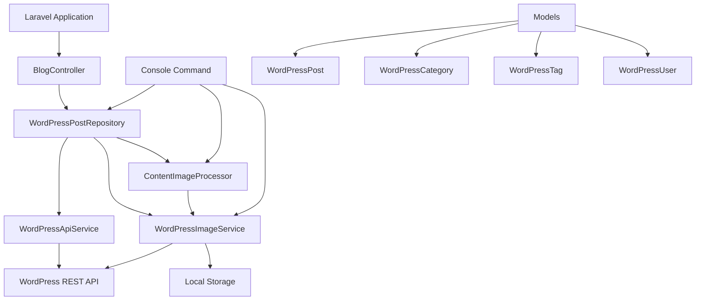

# Laravel WordPress CDA (Content Delivery Adapter)

A Laravel package that integrates WordPress as a headless CMS, fetching blog posts via the WordPress REST API and serving them locally with Laravel Eloquent-like model types. Perfect for maintaining a WordPress blog backend while serving content through your Laravel application.

## Features

- **WordPress API Integration**: Fetch posts, categories, tags, and authors from any WordPress REST API
- **Author-Specific Content**: Filter posts by a specific WordPress author
- **Laravel-Eloquent-Like Models**: Wrapper models (`WordPressPost`, `WordPressCategory`, `WordPressTag`, `WordPressUser`) that mimic Laravel Eloquent for seamless integration
- **Local Image Caching**: Automatically download and cache WordPress images locally with SEO-friendly paths
- **Content Image Processing**: Replace WordPress image URLs in post content with local cached versions
- **Built-in Caching**: Comprehensive caching for API responses and processed content
- **Yoast SEO Support**: Extracts and provides Yoast SEO meta data (title, description, Open Graph, Twitter Cards)
- **Pagination Support**: Full pagination support for post listings
- **Console Commands**: Artisan commands to cache content and images
- **Authentication Support**: WordPress Application Password authentication for private content

## Installation

```bash
composer require kalprajsolutions/laravel-wordpress-cda
```

## Configuration

Publish the configuration file:

```bash
php artisan vendor:publish --provider="KalprajSolutions\LaravelWordpressCda\WordPressCdaServiceProvider" --tag="wordpress-blog-config"
```

Configure your `.env` file:

```env
# WordPress REST API Base URL
WP_API_BASE_URL=https://your-wordpress-site.com/wp-json/wp/v2

# Author ID to filter posts (get this from WordPress Admin > Users)
WP_API_AUTHOR_ID=1

# Posts per page for API requests
WP_API_PER_PAGE=100

# Cache duration in minutes
WP_API_CACHE_DURATION=60

# Storage disk for cached images (configure in filesystems.php)
WP_API_FILESYSTEM_DISK=public

# Authentication (optional - for private WordPress content)
WP_API_AUTH_ENABLED=false
WP_API_USERNAME=your_username
WP_API_APP_PASSWORD=xxxx xxxx xxxx xxxx
```

## Usage

### Using the Repository

```php
use KalprajSolutions\LaravelWordpressCda\Repositories\WordPressPostRepository;

$repository = app(WordPressPostRepository::class);

// Get all posts with pagination
$posts = $repository->getAllPosts(10, 1);

// Get a single post by slug
$post = $repository->getPostBySlug('my-blog-post');

// Get posts by category
$posts = $repository->getPostsByCategory('technology');

// Get posts by tag  
$posts = $repository->getPostsByTag('laravel');

// Get recent posts
$recentPosts = $repository->getRecentPosts(5);

// Search posts
$results = $repository->searchPosts('search term');

// Get related posts
$related = $repository->getRelatedPosts($post, 4);
```

### Using the Model

```php
use KalprajSolutions\LaravelWordpressCda\Models\WordPressPost;

// Access post properties
$post->id;
$post->title;
$post->slug;
$post->summary;
$post->body;           // Processed content with local images
$post->rawBody;        // Raw content without processing
$post->featured_image; // Auto-cached featured image
$post->published_at;   // Carbon instance
$post->status;
$post->format;

// Relationships (return collections)
$post->categories();   // WordPressCategory collection
$post->tags();         // WordPressTag collection
$post->user();         // WordPressUser instance
$post->topic();        // Primary category (alias)

// SEO Meta (Yoast)
$post->meta['title'];
$post->meta['description'];
$post->meta['canonical_link'];
$post->meta['og_title'];
$post->meta['og_description'];
$post->meta['og_image'];
$post->meta['twitter_title'];
$post->meta['twitter_description'];
$post->meta['twitter_image'];

// Helper methods
$post->getUrl();
$post->getPublishedDate();       // "March 8, 2026"
$post->getPublishedDateDiff();  // "2 days ago"
$post->getReadingTime();         // 5 (minutes)
$post->hasComments();
$post->commentCount();
$post->getFormattedImage('full'); // Resize and cache featured image
```

### Available Routes

The package provides a `BlogController` that you can use in your routes:

```php
use KalprajSolutions\LaravelWordpressCda\Http\Controllers\BlogController;

// In your routes/web.php
Route::get('/blog', [BlogController::class, 'index']);
Route::get('/blog/{slug}', [BlogController::class, 'show'])->name('blog.post');
Route::get('/blog/category/{slug}', [BlogController::class, 'byCategory'])->name('blog.category');
Route::get('/blog/tag/{slug}', [BlogController::class, 'byTag'])->name('blog.tag');
```

### Using the Console Command

Cache all blog content:

```bash
# Cache all posts, categories, and tags
php artisan wp:cache

# Cache only first 5 pages
php artisan wp:cache --pages=5

# Cache posts AND images
php artisan wp:cache --images

# Clean cache before caching
php artisan wp:cache --clean --images
```

### Custom API Filtering

```php
$repository->getPostsByAuthor($authorId, $perPage);
```

## View Compatibility

The `WordPressPost` model is designed to be compatible with views expecting Canvas (or similar) blog models. It implements:
- `ArrayAccess` for meta data access
- `Arrayable`, `Jsonable`, `JsonSerializable` for serialization

Access content in Blade templates:

```blade
@foreach($posts as $post)
    <article>
        <h2>{{ $post->title }}</h2>
        featured_image }}" alt="{{ $post->title }}">
        <p>{{ $post->summary }}</p>
        <div>{!! $post->body !!}</div>
        <span>{{ $post->getPublishedDate() }}</span>
        <span>{{ $post->getReadingTime() }} min read</span>
    </article>
@endforeach
```

## Storage Setup

Add a new disk in `config/filesystems.php`:

```php
'disks' => [
    // ...
    'wordpress' => [
        'driver' => 'local',
        'root' => storage_path('app/public/blog-media'),
        'url' => env('APP_URL').'/storage/blog-media',
        'visibility' => 'public',
    ],
],
```

Make sure the storage link is created:

```bash
php artisan storage:link
```

## Architecture



## Requirements

- PHP 8.1+
- Laravel 10.0+ or 11.0
- intervention/image ^3.0

## License

MIT License - see [LICENSE](LICENSE) file for details.

## Author

Kalpraj Solutions - info@kalprajsolutions.com