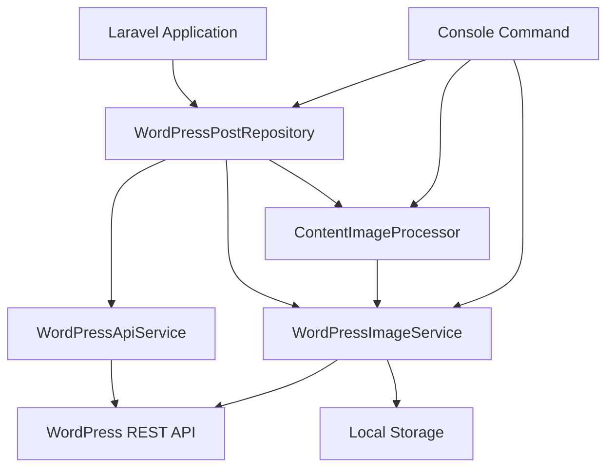
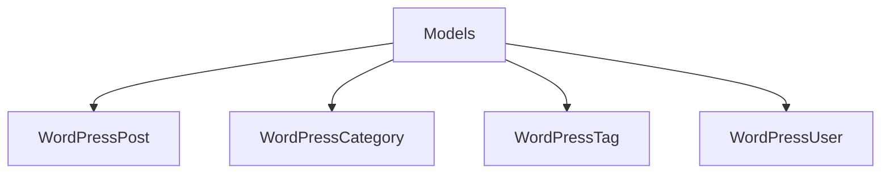

# Laravel WordPress CDA (Content Delivery Adapter)

A Laravel package that integrates WordPress as a headless CMS, fetching blog posts via the WordPress REST API and serving them locally with Laravel Eloquent-like model types. Perfect for maintaining a WordPress blog backend while serving content through your Laravel application.

## Features

- **WordPress API Integration**: Fetch posts, categories, tags, and authors from any WordPress REST API
- **Author-Specific Content**: Filter posts by a specific WordPress author
- **Laravel-Eloquent-Like Models**: Wrapper models (`WordPressPost`, `WordPressCategory`, `WordPressTag`, `WordPressUser`) that mimic Laravel Eloquent for seamless integration
- **Local Image Caching**: Automatically download and cache WordPress images locally with SEO-friendly paths
- **Content Image Processing**: Replace WordPress image URLs in post content with local cached versions
- **Parallel Image Downloads**: Batch download multiple images concurrently for faster caching
- **Built-in Caching**: Comprehensive caching for API responses and processed content
- **Yoast SEO Support**: Extracts and provides Yoast SEO meta data (title, description, Open Graph, Twitter Cards)
- **Pagination Support**: Full pagination support for post listings
- **Featured Posts**: Support for WordPress sticky/pinned posts
- **Author Categories & Tags**: Get categories and tags specific to the configured author
- **Console Commands**: Artisan commands to cache content and images
- **Authentication Support**: WordPress Application Password authentication for private content
- **View Compatibility**: Compatible with Canvas and other popular blog themes

## Installation

```bash
composer require kalprajsolutions/laravel-wordpress-cda
```

## Configuration

Publish the configuration file:

```bash
php artisan vendor:publish --provider="KalprajSolutions\LaravelWordpressCda\WordPressCdaServiceProvider" --tag="wordpress-blog-config"
```

Configure your `.env` file:

```env
# WordPress REST API Base URL
WP_API_BASE_URL=https://your-wordpress-site.com/wp-json/wp/v2

# Author ID to filter posts (get this from WordPress Admin > Users)
WP_API_AUTHOR_ID=1

# Posts per page for API requests (max 100)
WP_API_PER_PAGE=100

# Cache duration in minutes
WP_API_CACHE_DURATION=60

# Custom User-Agent string for API requests
WP_API_USER_AGENT=Laravel-WordPress-CDA/1.0

# Route name for blog post view (used for URL generation)
WP_API_BLOG_VIEW_ROUTE=blog.view

# Storage disk for cached images (configure in filesystems.php)
WP_API_FILESYSTEM_DISK=public

# Preserve WordPress year/month folder structure for images (true/false)
WP_API_PRESERVE_STRUCTURE=true

# Authentication (optional - for private WordPress content)
WP_API_AUTH_ENABLED=false
WP_API_USERNAME=your_username
WP_API_APP_PASSWORD=xxxx xxxx xxxx xxxx
```

## Usage

### Using the Repository

```php
use KalprajSolutions\LaravelWordpressCda\Repositories\WordPressPostRepository;

$repository = app(WordPressPostRepository::class);

// Get all posts with pagination
$posts = $repository->getAllPosts(10, 1);

// Get a single post by slug
$post = $repository->getPostBySlug('my-blog-post');

// Get a single post with immediate image caching
$post = $repository->getPostBySlug('my-blog-post', true);

// Get posts by category
$posts = $repository->getPostsByCategory('technology');

// Get posts by tag
$posts = $repository->getPostsByTag('laravel');

// Get recent posts
$recentPosts = $repository->getRecentPosts(5);

// Get featured/sticky posts
$featuredPosts = $repository->getFeaturedPosts(3);

// Get posts by specific author
$authorPosts = $repository->getPostsByAuthor($authorId, 10);

// Search posts
$results = $repository->searchPosts('search term');

// Get related posts
$related = $repository->getRelatedPosts($post, 4);

// Get author's categories with post counts
$categories = $repository->getAuthorCategories();

// Get author's tags
$tags = $repository->getAuthorTags();

// Clear cache
$repository->clearCache();
$repository->clearPostCache($postId);
```

### Using the Model

```php
use KalprajSolutions\LaravelWordpressCda\Models\WordPressPost;

// Access post properties
$post->id;
$post->title;
$post->slug;
$post->summary;
$post->body;           // Processed content with local images
$post->rawBody;        // Raw content without processing
$post->getRawBody();   // Also available as method
$post->featured_image; // Auto-cached featured image
$post->published_at;   // Carbon instance
$post->status;
$post->format;

// Relationships (return collections)
$post->categories();   // WordPressCategory collection
$post->tags();         // WordPressTag collection
$post->user();         // WordPressUser instance
$post->topic();        // Primary category (alias)
$post->comments();     // Comments collection

// SEO Meta (Yoast)
$post->meta['title'];
$post->meta['description'];
$post->meta['canonical_link'];
$post->meta['og_title'];
$post->meta['og_description'];
$post->meta['og_image'];
$post->meta['twitter_title'];
$post->meta['twitter_description'];
$post->meta['twitter_image'];

// Helper methods
$post->getUrl();
$post->getPublishedDate();       // "March 8, 2026"
$post->getPublishedDateDiff();   // "2 days ago"
$post->getReadingTime();          // 5 (minutes)
$post->getReadingTime(250);       // Custom words per minute
$post->hasComments();
$post->commentCount();
$post->getFormattedImage('full'); // Resize and cache featured image

// Image processing control
$post->setProcessContentImages(false); // Disable automatic image processing
$post->clearProcessedBodyCache();      // Clear cached processed content

// Access original API data
$post->getOriginalData();

// Array/JSON serialization
$post->toArray();
$post->toJson();
json_encode($post); // Uses JsonSerializable
```

### Using Category, Tag, and User Models

```php
use KalprajSolutions\LaravelWordpressCda\Models\WordPressCategory;
use KalprajSolutions\LaravelWordpressCda\Models\WordPressTag;
use KalprajSolutions\LaravelWordpressCda\Models\WordPressUser;

// WordPressCategory
$category->id;
$category->name;
$category->slug;
$category->description;
$category->count;      // Number of posts in this category
$category->parent;     // Parent category ID (0 for top-level)
$category->isTopLevel(); // Check if it's a top-level category
$category->getUrl();   // Category URL

// WordPressTag
$tag->id;
$tag->name;
$tag->slug;
$tag->description;
$tag->count;           // Number of posts with this tag
$tag->getUrl();        // Tag URL

// WordPressUser (Author)
$user->id;
$user->name;
$user->slug;
$user->url;            // Author's website URL
$user->description;    // Author bio
$user->avatarUrls;     // Array of avatar URLs by size
$user->getAvatarUrl(); // Get avatar URL (24, 48, or 96)
```

### Using the Console Command

Cache all blog content:

```bash
# Cache all posts, categories, and tags
php artisan wp:cache

# Cache only first 5 pages
php artisan wp:cache --pages=5

# Cache posts AND images
php artisan wp:cache --images

# Clean cache before caching
php artisan wp:cache --clean --images
```

## View Compatibility

The `WordPressPost` model is designed to be compatible with Canvas (or similar) blog models. It implements:

- `ArrayAccess` for meta data access (`$post['title']`)
- `Arrayable` for `toArray()` method
- `Jsonable` for `toJson()` method  
- `JsonSerializable` for `json_encode()` support

Access content in Blade templates:

```blade
@foreach($posts as $post)
    <article>
        <h2>{{ $post->title }}</h2>
        featured_image }}" alt="{{ $post->title }}">
        <p>{{ $post->summary }}</p>
        <div>{!! $post->body !!}</div>
        <span>{{ $post->getPublishedDate() }}</span>
        <span>{{ $post->getReadingTime() }} min read</span>
    </article>
@endforeach
```

## Storage Setup

### Image Cache Disk

Configure the disk for cached images in `config/filesystems.php`:

```php
'disks' => [
    // ...
    'wordpress' => [
        'driver' => 'local',
        'root' => public_path('content'),
        'url' => env('APP_URL') . '/content',
        'visibility' => 'public',
        'throw' => false,
    ],
],
```

The default disk is `public`. You can also use `local`, `s3`, or any other configured disk.

### Image Path Structure

By default, images preserve WordPress's year/month structure:
- `2026/03/image.jpg`

Set `WP_API_PRESERVE_STRUCTURE=false` to use hashed filenames:
- `images/a1b2c3d4..._20260310_123456_abc123def.jpg`

## Architecture





## Requirements

- PHP 8.1+
- Laravel 10.0+ or 11.0
- intervention/image ^3.0

## License

MIT License - see [LICENSE](LICENSE) file for details.

## Author

Kalpraj Solutions - kalprajsolutions.com
